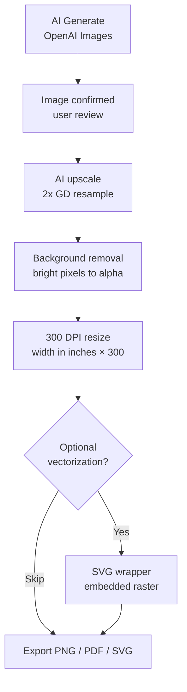

# AI production pipeline (product flow)

End-to-end flow implemented in the editor **AI panel → Production pipeline** and backed by API routes under `/api/projects/{project}/editor/...`.

## Target flow

```text
AI Generate
   ↓
Image Confirmed
   ↓
AI Upscale
   ↓
Background Removal
   ↓
Convert to 300 DPI
   ↓
Optional Vectorization
   ↓
Export PNG / PDF / SVG
```



## Implementation mapping

| Step | UI | Backend / client |
|------|----|-------------------|
| AI Generate | “Run AI generate” | `POST .../editor/canvas-image` (OpenAI) |
| Image confirmed | “Confirm image” | Client state only |
| AI upscale | “Run AI upscale” | `POST .../editor/pipeline/upscale` (GD) |
| Background removal | “Remove light background” | `POST .../editor/pipeline/remove-background` (threshold; best on light studio BG) |
| 300 DPI | “Convert to 300 DPI” + print width | `POST .../editor/pipeline/to-300dpi` (pixel dimensions = inches × DPI) |
| Optional vectorization | “Create SVG” or “Skip” | `POST .../editor/pipeline/vectorize` → SVG with embedded PNG (not Bézier tracing) |
| Export | PNG / PDF / SVG buttons | PNG = data URL download; PDF = `pdf-lib` in browser; SVG = file from server or prior step |

## Limits and next upgrades

- **Upscale** is resampling (true generative super-resolution would be a separate model/service).
- **Background removal** is luminance-based; hair and complex edges need a dedicated matting API.
- **Vectorization** here is **SVG embedding**; real curve tracing needs Potrace, Vector Magic, or similar.
- **300 DPI** sets pixel dimensions for a chosen print width; physical DPI metadata in PNG may still require print-shop RIP.

## Related env

- OpenAI (generate step only): `OPENAI_API_KEY`, `OPENAI_IMAGE_MODEL` (see `.env.example`).
