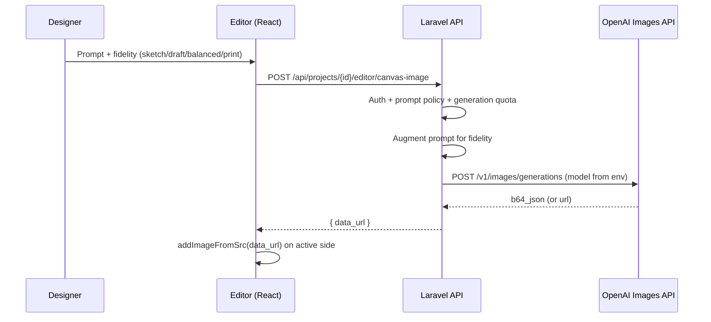

# Canvas flexibility, low-fidelity design, and OpenAI image flow

This document describes **what to improve** on the canvas for flexibility and **low-fidelity / exploration** workflows, and the **implemented flow** for OpenAI-generated images dropped straight onto the canvas (server-side API key; model from `OPENAI_IMAGE_MODEL`, default `gpt-image-latest`).

---

## 1. Current limitations (why it feels rigid)

| Area | Limitation | Impact |
|------|-------------|--------|
| **Modes** | Mostly “move/resize box” on a garment overlay | Hard to do storyboards, grids, or multi-idea comps |
| **Fidelity** | Single visual path (full layer on shirt) | No first-class “sketch / wireframe / comp” lane |
| **Precision** | Fraction-based transforms, limited guides | Slow pixel-perfect work vs design tools |
| **AI** | Queued “generation” vs instant canvas asset | Exploration loop is slower than “generate → place → tweak” |
| **Assets** | Raster in layout as data URLs | Large payloads; harder to swap resolutions cleanly |

---

## 2. Target improvement themes (product + engineering)

### A. Exploration modes (low fidelity)

1. **Sketch mode** (viewport-level): neutral background, optional grid, lower-contrast garment ghost; layers default to “comp” styling.
2. **Storyboard side** (optional virtual side): 2×2 or 3×3 cells, each cell a mini-canvas or one image per cell—export as “concept only” in preflight.
3. **Prompt presets**: “thumbnail”, “layout comp”, “final print” append different server-side prompt suffixes (already started for OpenAI fidelity: `sketch` / `draft` / `balanced` / `print`).

### B. Flexibility on the real garment canvas

1. **Snapping**: edges/centers of print region + optional smart snap to other layers.
2. **Guides**: draggable horizontal/vertical guides saved in `scratch_layout`.
3. **Numeric transform** in the layer panel (x, y, w, h, rotation in degrees).
4. **Multi-select** + align/distribute (even simple “align left” helps).
5. **Artboard zoom** decoupled from “garment preview scale” so you can zoom into a corner without shrinking the shirt.

### C. Data model (`scratch_layout` evolution)

1. Bump `layout_version` when adding: `guides[]`, `viewportMode`, `storyboardCells`.
2. Preflight rules that treat **hidden / sketch-only** sides as non-printing.

### D. AI loops

| Flow | Purpose |
|------|---------|
| **OpenAI → canvas (sync)** | Fast iteration: one PNG as a new image layer (implemented). |
| **OpenAI → job (async)** | Heavy or batched generations; optional future. |
| **Edit pass** | Send selected layer + mask to OpenAI *edits* endpoint (not implemented yet). |

---

## 3. Implemented: OpenAI image → canvas (end-to-end)

**Configuration (never commit secrets):**

- `OPENAI_API_KEY` — required for live calls.
- `OPENAI_IMAGE_MODEL` — default `gpt-image-latest`; if the API returns “unknown model”, set to `gpt-image-2` (or the model your org enables).
- Optional: `OPENAI_IMAGE_SIZE`, `OPENAI_TIMEOUT`.

**Queued generations** (`POST /projects/{id}/generations`): if `OPENAI_API_KEY` is set, the app binds `OpenAiImageProvider` so the worker can save a PNG under `storage/app/public/generations/` and set `output_url` to a `/storage/...` URL (run `php artisan storage:link`).

---

## 4. Suggested delivery phases (canvas roadmap)

| Phase | Outcome |
|-------|---------|
| **P0 (done here)** | OpenAI sync path + fidelity selector + improvement flow doc. |
| **P1** | Snapping + numeric transforms + guides (minimal schema). |
| **P2** | Storyboard / grid side + preflight “concept vs print” gating. |
| **P3** | OpenAI *edits* from selected layer; resolution-aware assets (not only data URLs). |

---

## 5. Security note

API keys must live only in **environment variables** on the server. If a key was ever pasted into chat, email, or a repo, **rotate it** in the OpenAI dashboard and update `.env` locally and in deployment secrets.
